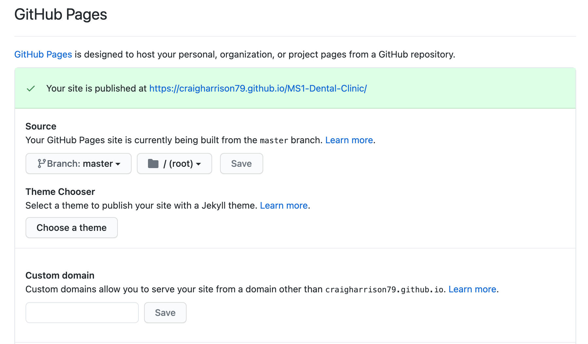
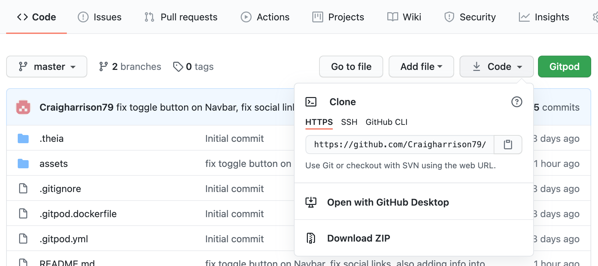

`python3 -m http.server`

# [Design Smile](https://craigharrison79.github.io/MS1-Dental-Clinic/)

For my first milestone project I have to build a static responsive front end website as part of my Diploma Course with the Code Institute.
I wanted to build a website of a family member who wanted to advertise her business through the Covid-19 times and beyond.

[View Live Website Here](https://craigharrison79.github.io/MS1-Dental-Clinic/)

## Table of Content

- [UX Design](#ux-design)
    - [Strategy](#strategy)
    - [Goals](#goals)
        - [Owner Goals](#owner-goals)
        - [User Goals](#user-goals)
- [Design](#design)
    - [Wireframes](#wireframes)
    - [Typography](#Typography)
    - [Color Scheme](#color-scheme)
    - [Image](#image)
- [Features](#features)
    - [Layout](#layout)
    - [Features to implement in the future](#features-to-implement-in-the-future)
- [Technologies used](#technologies-used)
- [Testing](#testing)
- [Deployment](#deployment)
- [Credits](#credits)
    - [Acknowlegements](#acknowlegements)
    - [Code](#code)
    - [Media](#media)

# UX

## Strategy

I sat down with the business owner and talk about her ideas of the website and the information to be display on the site.  This information is below in the goal section.  
Then I put myself in the potential customer view and wrote down a list of thing I would be looking for on visiting a dentist website.  I also ask a few friend and work
colleagues on there input as potential customer, again information list below.  With all this information I start to work on some different wireframes on paper.

## Goals

### Owner Stories:

The owner want a clean and easy to read website that is useable of young and old clients. She feel the colour pattern should be a shadow of blue as this represent the heath 
service community best. See colour scheme for more details.

#### Owner Goals:

Increase new clients to the business.
Help spread brand awareness.
Increase social following.
To pervert service information.
Pervert location and navigation to the clinic.
Pervert a way of potential and old client contact her.

### User Stories:

A user would split into two main types - Someone  who is looking a dentist and an existincustomer.  

New Customer is then break down into two categories - new to the area or need help with an issue.

#### New Customer Goals

    Need Help

        - To get hold of someone fast on the phone.
		- Which service you provide.
		- Testimonial and show of work.

	Move to the area

		- Location of a client (close to home or work).
		- Which service you provide.
		- Testimonial and show of work.
		- Contact point.
		- How the clinic looks.

#### Existing Customer Goals

	Need contact information to check appointment or cancel.
	Find out the address or location (maybe the second visit).
	Book an appointment
	Maybe link to any information site eg surgeons or insurance/government protocols on payment.

## Design

### Wireframes

After finish my drawing on paper, I use mockup [mockflow.com](https://www.mockflow.com/) on design the overall idea.  Link below to the design.
 
- [Png-desktop-iphone](assets/docu/website-wireframe_Page_1-png)
- [Png-Ipod](assets/docu/website-wireframe_Page_2-png)

Or
 
 - [Wireframes Download PDF](https://)

### Typography

I need to have a readable font of anyone to read. Some thing with clean lines and open and not to forcefully.  I pick ‘Roboto’ for my headings and then ‘Poppins’ of everything else.  Both have nice flowing lines and go well together.   I using Google Fonts (Link)
[Google Fonts](https://fonts.google.com/)

### Color Scheme

Blue: - represents intelligence, responsibility, trustworthy, dependable.  It’s also relaxing and a peaceful color.  
Readable information about the color blue meaning:

[Meaning color blue](https://www.bourncreative.com/meaning-of-the-color-blue/)
[Meaning of Blue](https://www.sensationalcolor.com/meaning-of-blue/)

### Images

- Landing photo is from istockphoto by piprod [iStockphoto](https://www.istockphoto.com/se/foto/leende-kvinna-p%C3%A5-40-%C3%A5r-gm977601820-265789058)

- service 1 photo is from Pxfuel by unknown [Pxfuel](https://www.pxfuel.com/en/free-photo-qhvsm)
- service 2 photo is from Unsplash by Jonathan Borba [Unsplash](https://unsplash.com/photos/W9YEY6G8LVM)
- service 3 photo is from Unsplash by Elena Mozhvilo [Unsplash](https://unsplash.com/photos/YzyvxfzddzA)

- clinic 1 photo is from Unsplash by Nastuh Abootaiebi [Unsplash](https://unsplash.com/photos/rSpMla5RItA)
- clinic 2 photo is from Pexels by Daniel Frank [Pevels](https://www.pexels.com/photo/black-and-white-dentist-chair-and-equipment-287237/)
- clinic 3 photo is from Pexels by Daniel Frank [Pevels](https://www.pexels.com/photo/chairs-arranged-on-table-305564/)
- clinic 4 photo is from Pexels by Daniel Frank [Pevels](https://www.pexels.com/photo/view-of-clinic-305568/)
- clinic 5 photo is from Pexels by Shvets Anna [Pevels](https://www.pexels.com/photo/green-leaf-potted-plant-2563411/)

## Features

#### Current Information

	Covid-19 guidelines and information

#### Navigation Bar

	Simple to use and easy to understand.  Always top of the page.

#### Landing page
	
	Welcome
	Call to action button

#### Service section

	Call to action button

#### Footer

	Social links
	Contat information
	Use full information links

### Future Features to Implement

- Feature 1: Online Booking
- Feature 2: Online Payment
- Feature 3: Online real time help chat
- Feature 4: Video promo - the owner doesn’t have one yet but would love to have one in the future.
- Feature 5: Consult form - have to link with government records and security acts.

## Technologies Used

### Languages

- HTML5
- CSS3

### Frameworks and Libraries

- Bootstrap 5
- Font Awesome
- Google Fonts

### Version Control

- Git
- GitHub
- Gitpod

### Other Programs

- Mockup
- W3C CSS Validator
- W3C HTML Checker
- Pic Resize
- Lamba Test
- Am I responsive
- W3C Spell Checker

- Chrome Development Tools

## Testing

Link to file

## Deployment

Deployment of the project is on GitHub Pages, this is how I deploy it:

- With the code being done in Gitpod and push to my repository in GitHub.
- Log-in to GitHub and moving to my repository and finding and opening MS1-Dental-Clinic.
- Locating and clicking on the settings in the menu bar on the top of the page.
- Scroll down the page till you reach the GitHub Pages section.
- In this section under the source click the dropdown select that read “None” and select master and then save.
- Refresh the page and scroll back down the same section and you find the published link for your site.

## Cloning the Project

Cloning the project

When you finish log into Github, navigate to the repository page and select MS1-Dental-Clinic.
Above the file list, click on the Code button next to the Gitpod button (green button).
Copy the URL.
Open your terminal.
Change the working directory to the location where you want the cloned directory.
Paste the URL after you have type git clone. eg
	$ git clone https://github.com/Username/repository-name
Press enter and this will create a local clone.

More information on cloning repository:
[Github Information](https://docs.github.com/en/github/creating-cloning-and-archiving-repositories/cloning-a-repository)

## Forking the Project

Forking the project

When you finish log into Github, navigate to the repository page and select MS1-Dental-Clinic.
Top right of the page click on the fork button.

More information on fork repository:
[Github Information](https://docs.github.com/en/github/getting-started-with-github/fork-a-repo)

## Acknowledgements

My Wife for letting me build her website.
Mentor Oluwafemi Medale for his feedback and help.
Code Institue for the knowledge you gave me.

Inspiration for website
www.

Youtube inspiration from Kevin Powell

[CodingNepal](https://www.codingnepalweb.com/2020/07/awesome-social-media-buttons-with-hover-animation.html) social media buttons.  

[maps.ie](https://www.maps.ie/creat-google-map/) map website builder.

[svg-waves](http://www.w3.org/2000/svg) website for svg waves.

