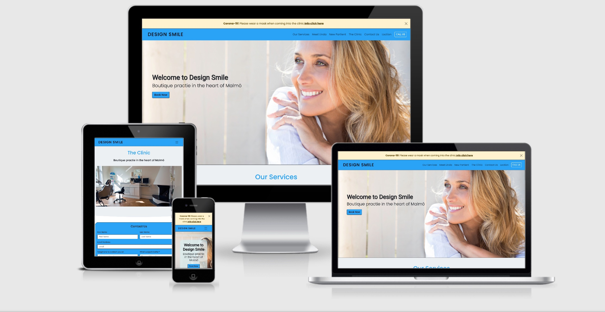
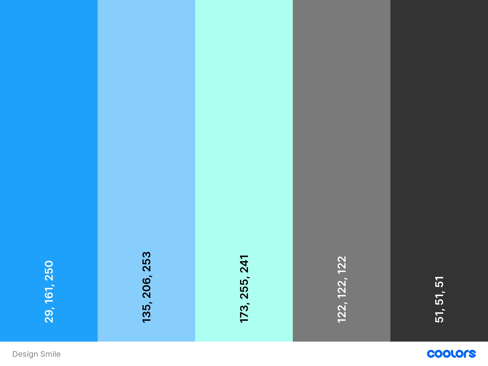

`python3 -m http.server`

# [Design Smile](https://craigharrison79.github.io/MS1-Dental-Clinic/)

For my first milestone project, I had to build a static responsive front end website as part of my Diploma Course with the Code Institute.
I wanted to build a website of a family member who wanted to advertise her new business through the Covid-19 times and beyond.
[View Live Website Here](https://craigharrison79.github.io/MS1-Dental-Clinic/)

## Table of Content

- [UX Design](#ux-design)
    - [Strategy](#strategy)
    - [Goals](#goals)
        - [Owner Goals](#owner-goals)
        - [User Goals](#user-goals)
- [Design](#design)
    - [Wireframes](#wireframes)
    - [Typography](#Typography)
    - [Color Scheme](#color-scheme)
    - [Image](#image)
- [Features](#features)
    - [Layout](#layout)
    - [Features to implement in the future](#features-to-implement-in-the-future)
- [Technologies used](#technologies-used)
- [Testing](#testing)
- [Deployment](#deployment)
- [Credits](#credits)
    - [Acknowlegements](#acknowlegements)
    - [Inspiration from website](#Inspiration-for-website)
    - [Code](#code)
    

# UX

## Strategy

Frist I sat down with the business owner and talk about her ideas of what the website is and the information to be display on it and how it should look.  

This information is below in the [goal](#goals) section.  

Then I put myself in the position of a potential customer and wrote down a list of thing I would be looking/searching for when visiting a dentist website.  
I also ask a few friends and work colleagues on there input as potential customer, again information list below.  With all this information I start to work 
on some different [wireframes](#wireframes) on paper.

## Goals

### Owner Stories:

The owner wanted a clean and easy to read website that is useable for young and older clients. She feels it's best to use a colour pattern of different shade of 
blue's as this represent the heath service community best. See [colour](#color-scheme) scheme for more details.

#### Owner Goals:

Increase new clients to the business.
Help spread brand awareness.
Increase social following.
To pervert service information.
Pervert location and navigation to the clinic.
Pervert a way of potential and old client contact her.

### User Stories:

A user would split into two main types: 

- Someone who is looking for a dentist.
    - New Customer is then break down into a far  two more categories: 
        - New to the area.
        - Needs help with an issue.
- Existing customer. 

- #### New Customer Goals

- Needs Help?

    - To get hold of someone fast on the phone.
	- Which service they provide.
	- Testimonial and show of work. (Which at the time of building the site the owner doesn't have permit to view on the site.)

- Move to the area

	- Location of a client (close to home or work).
	- Which service they provide.
	- Testimonial and show of work. (Which at the time of building the site the owner doesn't have permit to view on the site.)
	- Contact point.
	- The look of the clinic.

- #### Existing Customer Goals

	- Need contact information to check appointment or cancelltion.
	- Find out the address or location (maybe it's a second visit).
	- Book an appointment.
	- Maybe link to any information site eg surgeons or insurance/government protocols on payment.

# Design

### Wireframes

After finish my drawing on paper, I use mockup [mockflow.com](https://www.mockflow.com/) on design the overall idea.  Link below to the design.
 
- [Png-desktop-iphone](assets/docu/website-wireframe_Page_1-png)
- [Png-Ipod](assets/docu/website-wireframe_Page_2-png)

Or
 
 - [Wireframes Download PDF](https://)

### Typography

I need to have a readable font that was easy for anyone to read. A font with clean lines and open and not to forcefully.  I pick ‘Roboto’ for my headings and 
then ‘Poppins’ of everything else.  Both have nice flowing lines and go well together.   I using [Google Fonts](https://fonts.google.com/)

### Color Scheme

Blue: - represents intelligence, responsibility, trustworthy, dependable.  It’s also a relaxing and a peaceful color.

Readable information about the color blue meaning:

- [Meaning color blue](https://www.bourncreative.com/meaning-of-the-color-blue/)

- [Meaning of Blue](https://www.sensationalcolor.com/meaning-of-blue/)

### Images

- Landing photo is from istockphoto by piprod [iStockphoto](https://www.istockphoto.com/se/foto/leende-kvinna-p%C3%A5-40-%C3%A5r-gm977601820-265789058)
    - I wanted to find a photo of someone smile in a relax position.  Something that is a clean image and is offset to the right so I could display the welcome message
next to it with easy.

- service 1 photo is from Pxfuel by unknown [Pxfuel](https://www.pxfuel.com/en/free-photo-qhvsm)
- service 2 photo is from Unsplash by Jonathan Borba [Unsplash](https://unsplash.com/photos/W9YEY6G8LVM)
- service 3 photo is from Unsplash by Elena Mozhvilo [Unsplash](https://unsplash.com/photos/YzyvxfzddzA)

- clinic 1 photo is from Unsplash by Nastuh Abootaiebi [Unsplash](https://unsplash.com/photos/rSpMla5RItA)
- clinic 2 photo is from Pexels by Daniel Frank [Pevels](https://www.pexels.com/photo/black-and-white-dentist-chair-and-equipment-287237/)
- clinic 3 photo is from Pexels by Daniel Frank [Pevels](https://www.pexels.com/photo/chairs-arranged-on-table-305564/)
- clinic 4 photo is from Pexels by Daniel Frank [Pevels](https://www.pexels.com/photo/view-of-clinic-305568/)
- clinic 5 photo is from Pexels by Shvets Anna [Pevels](https://www.pexels.com/photo/green-leaf-potted-plant-2563411/)
    - At this time the clinic is being build so we have no photos as of yet.  I use the photos above to be place holders for the time being.

# Features

- #### Current Information

	- Covid-19 guidelines and information.
        - This will give the customers a clear understand on how to behave when coming to the clinic and hoply making them feel safe when visiting the clinic.

- #### Navigation Bar

	- Simple to use and easy to understand.  Always top of the page.
        - With a call button to make it quick and easy to contact the clinic. This is one of the main responsive existing customer will be using the site for. 
        To book, cancels or to ask questions. So a fast way to find a way of calling the clinic is key.

- #### Landing page
	
	- Welcome
        - To begin a brand awareness to the customer and understand who or what it is the customer is looking at.
	- Call to action button.
        - To help generate leads and a call to action.  Help the owner increase new clients.

- #### Service section

	- Bring awareness to the services the company provides.
        - For the customers help them and find if the company fit there needs.
        - Owner to provide clear and concise information on the services they provide.

- #### About section

    - Information about the company (herself) and New Patient information.
        - Customers to help get a feeling for who the company is and what them stand for.
        - Owner to raise brand awarencess and increase company credentials and professionalism.
        - To help generate leads and a call to action.  Help the owner increase new clients.

- #### Clinic section

    - To show images of the clinic.
        - Help customers to get a feeling and professinalism about the place and company.
        - To show off the standard of the pracitce.
        - To new customers, familiarize customers to the clinic before they visit.

- #### Contact Us section

    - To show opening times and contact information. One of the most visit page on the website.
        - Give the customer number of possibility to contact the clinic.
        - Owner this page can help drive new customer to the clinic.
        - Help answer question a customer may have like how to contact they and opening times, so customer know when they could contact someone.

- #### Locating section

    - To show the address and location of the company.
        - Help first customer to find the clinic.
        - Help potential customer understand if the clinic is in a viable location for them.
        - Give the owner a easy way to help customer who are lost to find the clinic.

- #### Footer

	- Social links.
        - To increase brand awareness.
        - Hoply driving new customer to the business.
	- Contat information
        - Second place to find the information customer may need.

### Future Features to Implement

- Feature 1: Online Booking
    - This will help increase business and help take the burden off the staff to take phone calls.
- Feature 2: Online Payment
    - Make it easy for customer to payment bill and offer a extra service to them.
- Feature 3: Online real time help chat
    - To help customer with any queries and help any one who could have hearing issues.  Increase brand awareness and customers.
- Feature 4: Video promo - the owner doesn’t have one yet but would love to have one in the future.
    - Increase brand awareness.
- Feature 5: Consult form - have to link with government records and security acts.
    - Help owner to reduce paper work and speeding up the customer interaction and service.  Giving more times to help the customer get the treatment in times.

# Technologies Used

### Languages

- HTML5: used to structure the page.
- CSS3: used to add style and look of the page.

### Frameworks and Libraries

- Bootstrap 5: to help build the layout of the page with the use of the library.
- Font Awesome: a library full of icons.
- Google Fonts: a library full of fonts.

### Version Control

- Git: Version control from gitpod, save, commits and push code to Github.
- GitHub: Live site to save code.
- Gitpod: Local respoitory to read the develop code.

### Other Programs

- Mockup: Used to design my wireframes.
- W3C CSS Validator: Used to check of errors in HTML code.
- W3C HTML Checker: Used to check of errors in CSS code.
- Pic Resize: picture resize and crop tool to help resize, crop, compress, add effects to your images, photos, and screenshots.
- Am I responsive: is a high fidelity responsive design tool for previewing your site across a variety of popular devices.
- W3C Spell Checker: This tool allows you to check the spelling of a web page.
- Chrome Development Tools: Web developer tools built directly into the Google Chrome browser. Help developer diagnose problems as they work on project.
- Responsive viewer: To test your website responsiveness across different devices.
- Wave Accessibility: helps you make their web content more accessible to different people with disabilities.
- Google lighthouse: Check your site Performance, Accessibility, Best Pracitces and SEO and give it a rating out of a 100.
- Shrinkme: use to compress some photos [here](https://shrinkme.app/)
### Media

- istockphoto: Photo library website.
- Pxfuel: Photo library website.
- Unsplash: Photo library website.
- Pexels: Photo library website.

# Testing

Testing process can be read [here](assets/docu/testing.md).

# Deployment

Deployment of the project is on GitHub Pages, this is how I deploy it:

- With the code being done in Gitpod and push to my repository in GitHub.
- Log-in to GitHub and moving to my repository and finding and opening MS1-Dental-Clinic.
- Locating and clicking on the settings in the menu bar on the top of the page.
- Scroll down the page till you reach the GitHub Pages section.
- In this section under the source click the dropdown select that read “None” and select master and then save.
- Refresh the page and scroll back down the same section and you find the published link for your site.

## Cloning the Project

Cloning the project

When you finish log into Github, navigate to the repository page and select MS1-Dental-Clinic.
Above the file list, click on the Code button next to the Gitpod button (green button).
Copy the URL.
Open your terminal.
Change the working directory to the location where you want the cloned directory.
Paste the URL after you have type git clone. eg
	$ git clone https://github.com/Username/repository-name
Press enter and this will create a local clone.

More information on cloning repository:
[Github Information](https://docs.github.com/en/github/creating-cloning-and-archiving-repositories/cloning-a-repository)

## Forking the Project

Forking the project

When you finish log into Github, navigate to the repository page and select MS1-Dental-Clinic.
Top right of the page click on the fork button.

More information on fork repository:
[Github Information](https://docs.github.com/en/github/getting-started-with-github/fork-a-repo)

# Credits

## Acknowledgements

- My Wife: for letting me build her website.
- Mentor: Oluwafemi Medale for his feedback and help.
- Code Institue: for the knowledge you gave me.
- W3School: For helpful reminders.
- Kevin Powell: inspiration and knowledge.

## Inspiration for website

- [smileandcompany](https://smileandcompany.com/#top)

## Code

[CodingNepal](https://www.codingnepalweb.com/2020/07/awesome-social-media-buttons-with-hover-animation.html) social media buttons.  

[maps.ie](https://www.maps.ie/creat-google-map/) map website builder.

[svg-waves](http://www.w3.org/2000/svg) website for svg waves.

Slack Overflow: For helping link the button to make a phone call.

