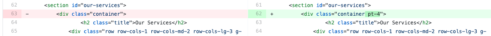
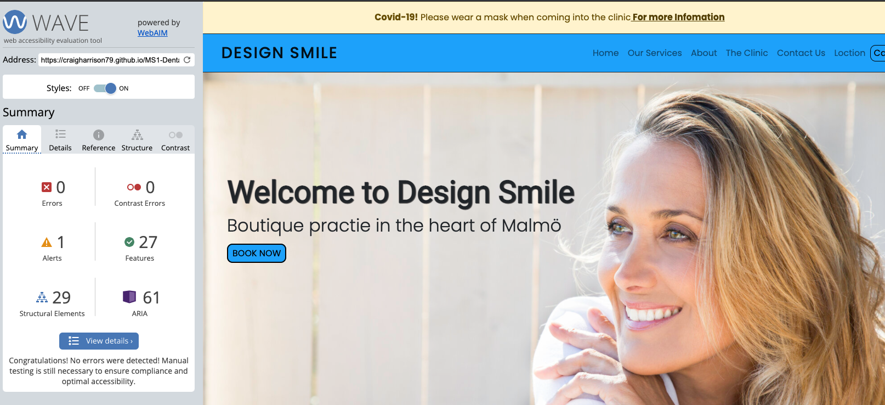

# **Testing Dental-Clinic**

- ## Testing User Experience and Stories (UX)

    - First time visitor goals:

        - As a first time using of the site, I wanted to understand what serivces is on offered, the main purpose of the site and how I can contact someone.  

            1. On visiting the website the customer is greeted with a easy to read website that is clean on the eye. 
            A simple navbar that is plan and easy to understand with an call to action button "Call Us"  This give the customer
            a quick and easy way to contact someone without having to search the website.

        
            2. Just below the navbar is the hero image, welcome message and also with a "Book Now" call to action button.  This call
            to action button will send the user straight to the contact page.

            3. From entering the site the user is given options to navigate the site one by navbar and two by scroll down. And two ways to 
            contact someone by one by telephone and one by email.  
    
        - As a first time visitor, I wanted the site to be easy to navigate and easy to move, to and from different section.

            1. I design the navbar to be fix to the top of the page so the user always has a recognize spot to navigate from.
         
            2. When the user click on any call to action buttons the use will be transport to the relevant section on the page.  If this is to a form then
            the site will open a "model" which keep the user at the same spot on the site and avoid any confusion about their place on the site.
         
            3. Model give a customer two ways to exit.  One to just click on the website page to return to the page or Two a cross at top of the model to click to exit. 
            This will give the user a clean way to exit and return to the site.

        - As visiting for the first time. I want to get a idea of what services are on offer,  as well as some information about the ower.

            1. As the user scroll down they will arrive on the service section where they in read about the different type of services.  On scrolling further the user will be
            able to read about the owner.

                1a. On the user reading about the owner they have a call to action book to allow the user to email about becoming a customer.

        - As a first time visitor, I want to find the location of the business.

            1. The user can naviagate using the navbar to the location section and on arrival they are greeted with the map and address.  The address once again in the footer section
            at the bottom of the page.

    - Returning customer goals:

        - As a customer returns, I want to find more information about the business, like how to interact with the business.

            1. The user can find social media in the footer which allows them to engage and keep them up to date with the going on in the business.

        - As a returning visitor, I want to have a easy way of getting in contact with the business to gain further information about a particular thing.

            1. Like in the first time visitor above, I place a call to action button "Call Us" in the navbar. This give the visitor a quick and easy way to phone the business. But when view on a phone
            the call to action button will be place below on the hero image and below the welcome message, as it will unviewable due to the toggle menu.  Place the button here still allows the visitor 
            to see the button once the page has loaded.

            2. Like above the is a call to action button also in the hero image section to allow the visitor the options to email any question they may have.

            3. I also in the footer I left the email address for if someone wanted to send a email via the visitor email account or if the user wanted to take it for future uses.

            4. The user can also use the navbar to location the contact section to leave a message about any question they have.

# Bugs issues and solutions

## Navigation issues

- **Issue:** Toggle button is not opening when clicked on.

    > **Solution:** I must have accidentally deleted part of the code when copying it for [Bootstrap](https://getbootstrap.com/docs/5.0/components/navbar/).
    I just read through and debuged the code.  I referenced bootstrap to analyze the difference between the codes.

    

- **Issue:** Toggle button moving over to the left side on smaller screen size.

     > **Solution:** To change you branding size on different screen sizes.  Reducing the size helped the toggle button to sit on the right side of the screen.

     

## Landing Page

- **Issue:** Brand and message covering the hero image face on smaller screen, which was making it harder to see the text due to the contrast between text and image.

     > **Solution:** To build a jumbotron to help, this helped improve readability and contrast issues.

     

## About Page

- **Issue:** Having issues with getting the two cards to align/float next to each other. This was something that took me the longest to fix. 

     > **Solution:** I started by trying different things with the code like flexbox, grids which didn't make any difference at all.  I ended up reading through the code
     until I noticed I had added an extra row in the code. Just deleting this and all was good. Rookie mistake I guess!

     

- **Issue:** Lining issues with profile photo and H3 profile name.  As the screen change size the photos start to cover up the H3. 

     > **Solution:** To write some media query to move the photo to the center, top of the card as the screen size decreases.  

     
     

## New Patient (model)

- **Issue:** Alignment issues with check marks on second model "If uncheck please enter the last time you visited the dentist?".

     > **Solution:** Had to add a little padding in CSS.

     

## Footer social media links

- **Issue:** Social media links - on safari the icons drop out of alignment with hover over. Also on iphone and ipad the is no mouse
and finger touch wouldn't open the link on be able to click on. 

     > **Solution:** This is something I tried to fix by myself and serching on the internet. I added some webkits 
     [Stack Overflow](https://stackoverflow.com/questions/21767037/css-transitions-not-working-in-safari) but this didn't help. 
     It was a code I found on youtube [CodingNepal](https://www.codingnepalweb.com/2020/07/awesome-social-media-buttons-with-hover-animation.html). 
     I talked to my mentor and he said it was to do with compatibility with safari.

    

    This is something I will need to come back to and fix in the future.  Thinking I could possible do it with Javascript.

    

     > **Solution 2:** Was to set a different set of code to switch on when in smaller screen modes.  Removing the more elaborate code for something simpler
     and easier to use.

     

## Padding on Anctor

- **Issue:** Page was not lining up with each section when using the navbar link button. The page would move down but cut off the heading of the section so 
you didn't know if it was the right section you arrived to. 

     > **Solution:** Was to add padding to each section with the use of [Bootstrap](https://getbootstrap.com/docs/5.0/utilities/spacing/#notation)
     and CSS to fix the problem.

     e.g.

     

## i-frame

- **Issue:** This was slowing down the web loading time and also I needed to change the code in HTML (3rd party) to CSS as it was writen in the HTML code.

     > **Solution:** Remove the unwanted parts of the code and create a CSS class.  Transferring the code into the style sheet.

    

- In the end, I just removed the whole 3rd party code [maps.ie](https://www.maps.ie/creat-google-map/) and embeded google map. When I first tried to
embed google map the link was not working.  Map was not sizing right even after using CSS to improve the ratio of size.  Plus the map was showing me the wrong location.
But after using the 3rd party site I decided to go back to using google map to embed the map, and this time it was working.  I don't know why but I think styling the maps.ie and then
changing back to goolge map made it work.  I wish I could explain this in more detail but I can't.

## Call Us button

- **Issue:** Call us button move into the toggle button when on a smaller screen. I wanted the customers to be able to see
it straight away when the website loads and the customers doesn't have to search for it.

    > **Solution:** To hide the button in Navbar toggle button on smaller screen and making it appear in hero image on smaller screen. Using d-lg-block and d-lg-none.
    This works in reverse on bigger screens.

# Testing on devices

Testing was done on different elements to see how the site preforms and the responsiveness of the site.

Browsers:

- Chrome, Firefox, Safari and Opera.

Devices:

- Mac (Macbook), Ipad and Iphone 11 and using developer tools in Chrome: (Moto G4, Galaxy S5, Pixel 2, iPad Pro,
Surface Duo).

### Responsiveness on devices.

With the responsiveness being viewed through different devices and different screen sizes, changes had to be made.

- **Issue:**
> - toggle button.
> - call button on Navbar.
> - navbar brand name, font-size change.
> - changing from three cards to two cards on the service section (iPad).
> - profile photo in the about section.
> - about section heading 1, font-size change.
> - social media links in footer section.
> - jumbotron on landing page.
> - some padding and margins were changed to help with alignment and the look on smaller screen.

# Accesibility

Wave Report showed the following issues:

Click here to [view](testing-code/wave.jpg)

> - Fixing the contrast errors by changing the white text to black as well as the call us button.
> - Going through the index and changing the heading number to decline in the correct order.
> - Adding missing labels and correct the errors.

 

> - Adding fieldset to the model that was missing.
> - Fixing the links " suspicious and redundant links". One was the remove the click here text and the other was to remove href that was double up.

I was left with one alterts "device dependent event handler from the Javascript". I used the following code. [link here to page](https://stackoverflow.com/questions/23857507/how-to-trigger-a-phone-call-on-button-click-in-a-php-website)
As this is Javascript and in the course we have not dealt with this yet, I have to pass on this alert.  This is something I will need to come back to and fix later in the course.  I tried to google some helpfully information but couldn't find
anything that was a simple fix without getting into Javascript.

# Google lighthouse

Lighthouse report showed the folloing issues:

### To improve the rating scores

#### Performance

- I had to change the aspert ratio on some photos, as well as compressing and changing some photos to webp 
which help with loading speed.  I could also remove some unused JavaScript to bootstrap but as I have not worked with JavaScript
yet in this course, I could come back and fix this later on.  Also change from a 3rd party for googlemap and use googlemap embed.
When I first started the project I couldn't get this to work but after using the 3rd party site,  It just worked for me. I think this
is because of the css style it give me.

#### Accesibility

- Low-contrast text is difficult or impossible for many users to read. This is on the iframe (googlemap) which I feel is ok. As the
score is 96, I feel this is fine and don't need to change the look for the website to get a few extra points.

#### Best Practices

- Links to cross-origin destinations are unsafe

#### SEO

- This was at 100%.

# HTML & CSS Validation

## W3C Markup CSS Validation

Using W3C CSS validation service I pasted the URL and I got 18 errors and lot of warnings.
When looking at the code all errors and warnings are from bootstrap issues.

I them paste the whole of my CSS code from the project and end up with no errors and 1 warnings.

The one of the warnings is about the transition kits use to help me fix the social media links in the footer.

## W3C Markup HTML Validation

When running the code in W3C HTML, I came across 5 errors (see below):

### After fixing the errors: 

1. removing the button element and using some code [link here to page](https://stackoverflow.com/questions/23857507/how-to-trigger-a-phone-call-on-button-click-in-a-php-website)

2. removing alt tag from the class hero img tag "Attribute alt not allowed on element div".

3. removing descendant a tag from element "Element button must not appear as a descendant of the a element".

4. remove google map 3rd party iframe and embed google map.

5. adding field to the form action element.

