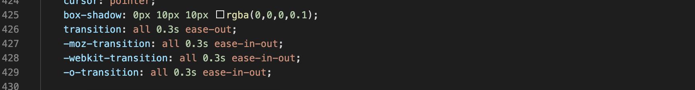

# **Testing Dental-Clinic**

Here is the stories of testing history....

# In the development process, the issues and solution that came up.

## Navigation issues

- **Issue:** Toggle button is not opening when click on.

    > **Solution:** I must of accidentally deleted part of the code when copying it for [Bootstrap](https://getbootstrap.com/docs/5.0/components/navbar/).
    I just read through and debug the code.

    

- **Issue:** Toggle button moving over to the left side on smaller screen size.

     > **Solution:** To change you branding size on different screen sizes.

     

## Landing Page

- **Issue:** Brand and massage covering the hero image face, which was making it harder to see the text.

     > **Solution:** To build a jumbotron to help which helped improve readability.

     

## About Page

- **Issue:** Having issues with getting the two cards to align/float next to each other.  

     > **Solution:** I started by trying different things with the code like flexbox, grids 
     till I know noticed I had added an extra row in the code.

     

- **Issue:** Lining issues with profile photo and H3 Name.  As the screen change size the photos start to cover up the H3. 

     > **Solution:** To write some media quoted to move the photo to the center, top of the card.

     
     

## New Patient (model)

- **Issue:** Align issues with check marks on second model "If uncheck please enter the last time you visit the dentist?".

     > **Solution:** Had to add a little padding in CSS.

     

## Footer social media links

- **Issue:** Social media links - on safari the icons drop out of alignment with hover over.  

     > **Solution:** This is something I try to fix by myself and serching on the internet. I added some webkits 
     [Stack Overflow](https://stackoverflow.com/questions/21767037/css-transitions-not-working-in-safari) but this didn't help. 
     It was code I found on youtube [CodingNepal](https://www.codingnepalweb.com/2020/07/awesome-social-media-buttons-with-hover-animation.html). 
     I talk to my mentor and he saying it was to do with compatibility with safari.

     

     This is something I will need to come up to and fix.  Thinking I could possible do it will Javascript.

     

     